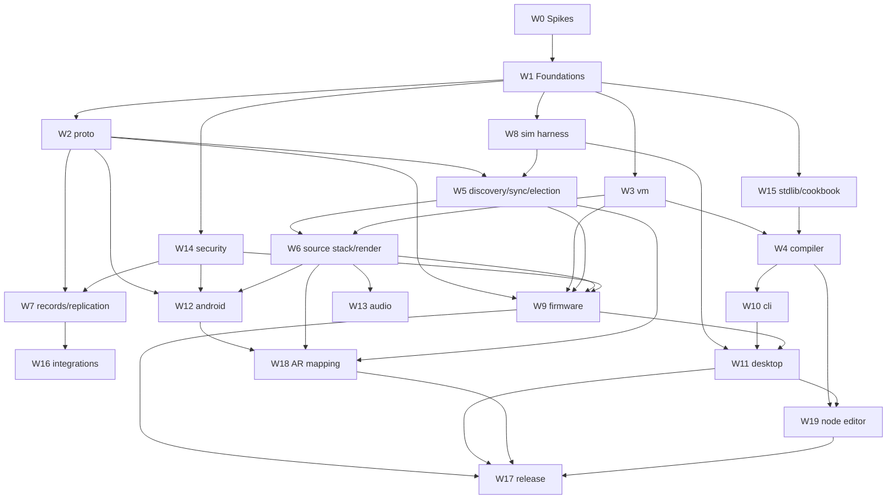

A route from nothing to a releasable 1.0.0, with the dependency structure made explicit so it is obvious what is blocked, what is parallel, and what is on the critical path.

Assumes one experienced developer as the baseline, with notes on where a second or third person can work without collisions.

## What 1.0.0 is

**A mesh of ESP32 devices that renders authored effects in sync, runs autonomously, is controlled from a phone, is patched in a visual node editor, and knows where every LED physically is.**

The last two are what make this worth using rather than another way to connect lights. AR mapping is the reason volumetric effects can exist at all, and the node editor is the reason someone who is not a programmer can build one. A release without them would be technically impressive and strategically pointless — so both are in 1.0, and the schedule absorbs the cost rather than the scope shrinking to fit.

Everything else is judged against those two: if a feature is not required to make mapping or visual authoring work, it waits.

### In scope

| Area | 1.0.0 contains |
|---|---|
| Firmware | ESP32-C3/S3, WS2812 + APA102, colour pipeline with dithering and power limiting, NVS, OTA |
| Timing | Show clock, sync to ±500 µs, timebase election, 120 Hz frame grid |
| Execution | Bytecode VM, `pixel` profile only |
| Language | Full grammar, stdlib v1, compiler, CLI |
| Runtime | Source stack, zones (explicit + geometric), projections, scenes, schedules, bindings |
| State | Replication, keepers, signed records, autonomy with no app present |
| Channels | Audio (device I2S and desktop loopback), external values |
| Security | Pairing, mesh key, signed programs and records |
| Mapping | Synthetic, rough manual placement, **and full AR per-LED capture** |
| Authoring | Text and CLI, **and the visual node editor** |
| Apps | Phone: provisioning, pairing, control, monitoring, AR mapping. Desktop: node editor, CLI, simulator, 3D preview, diagnostics |
| Integration | HTTP endpoint, MQTT, Home Assistant |
| Project | Conformance suite, cookbook, board definitions, docs |

### Deferred, with the release they naturally belong to

| Deferred | Why it is safe to defer | Target |
|---|---|---|
| Room mesh capture | Wall geometry is a refinement on top of LED positions, not a prerequisite | 1.1 |
| Multi-device origin best-fit | Manual and QR anchoring cover origin calibration; this is an accuracy refinement | 1.1 |
| Timeline / parameter automation | The node editor is the differentiator; timed automation is ordinary | 1.1 |
| Node encapsulation into reusable nodes | The editor is valuable before it is composable | 1.1 |
| GUI firmware tool | Prebuilt binaries plus CLI flashing cover 1.0; the GUI is convenience | 1.1 |
| Colour calibration UI | Ship the *field* and pipeline in 1.0; tooling to fill it can wait | 1.1 |
| `sim` VM profile, particles | Local history buffer covers trails, fire and comets within a device | 1.2 |
| Cue lists, MIDI/OSC live control | Needs an audience before it earns its complexity | 1.2 |
| Probe debugging, hardware time control | Compile warnings and the simulator cover most of the need | 1.2 |
| Federation | One mesh is the common case | 1.3 |
| Art-Net / E1.31 / DDP | DDP-in only if it is cheap; the rest waits | 1.3 |
| Bridges, BLE/Zigbee nodes | Large surface, small initial audience | 1.3 |
| `caps=compile` on-device | Blocked on a measurement anyway | 1.3 |
| iOS | Android first was already decided | 1.4 |

The compensating trim is the **GUI firmware tool**: 1.0 ships the signed prebuilt matrix plus `lumen flash` on the command line, and the point-and-click board configurator arrives in 1.1. It is genuinely useful but it is not why anyone would choose this system, and it is the largest non-differentiating item available to cut.

### Honest cost of including both

Adding AR mapping and the node editor roughly **doubles the work to 1.0**. That is worth stating plainly rather than discovering at month nine. Two things make it tolerable:

- They sit in **different lanes** — AR is Android, the editor is desktop — so with two or three people they run fully in parallel rather than in series.
- Neither is on the other's critical path, and both depend on work that must happen anyway.

What makes it *intolerable* is retrofitting their prerequisites, which is why three of them move earlier — see below.

## Prerequisites to pull forward

Including these two features changes work that happens much earlier. Doing them late is the expensive path.

**1. The compiler must expose its AST as a public API, plus a formatter.** The node editor's real cost is not the canvas — it is the bidirectional text↔graph mapping. `lumen-lang` needs a stable AST type, an edit API, and `fmt` that round-trips, all built into W4 rather than bolted on. Adds ~M to W4 now; costs a compiler refactor later.

**2. Node layout needs a storage decision now.** [[Effect Language]] says layout lives in a trailing comment block or a sidecar. Decide before the format has users: a sidecar keeps `.lfx` files clean for sharing, which is consistent with the cookbook's prose-in-sidecar decision.

**3. The phone must join the show clock.** AR capture correlates camera frame timestamps against blink phases, which means the phone needs mesh time, not just a network connection. That is a small addition to W12 and a nasty retrofit.

### Two findings that make AR cheaper than expected

**Identify patterns are just effects.** A gray-code sweep is `bit(i, floor(t * rate))`, and a per-LED binary code is a hash of `i` against time. So mapping capture needs **no new protocol messages at all** — the phone pushes a source at high priority running a capture effect, and the source stack's existing expiry means a crashed mapping session cannot leave the lights stuck blinking. This removes a whole message family from the plan.

**Prefer self-clocking codes over sync-dependent ones.** If each LED emits a Manchester-encoded self-describing ID, the phone can decode it without knowing the mesh clock precisely — sync becomes a refinement for accuracy rather than a hard dependency. It makes the capture robust to dropped camera frames, which is the common failure in a real room.

## Workstreams

| # | Workstream | Repo | Size |
|---|---|---|---|
| W0 | Spikes S1/S2/S3 | throwaway | S |
| W1 | Foundations: repos, CI, HAL traits, IDL skeleton, `lumen-dev` | all | M |
| W2 | `lumen-proto` codec + codec conformance vectors | core | M |
| W3 | `lumen-vm` interpreter, `pixel` profile | core | M |
| W4 | `lumen-lang` compiler: lexer → parser → resolve → partition → hoist → emit, **plus public AST, edit API and `fmt`** | core | XL |
| W5 | Discovery, time sync, elections | device | L |
| W6 | Source stack, zones, projections, compositor, render loop | device | L |
| W7 | Records, signing, gossip replication, bindings, schedules | device | L |
| W8 | `lumen-sim`: simulated HAL, scenario harness, deterministic replay | device | M |
| W9 | Firmware: esp-idf HAL, LED drivers, colour pipeline, NVS, OTA, provisioning | firmware | XL |
| W10 | `lumen-cli`: compile, budget, publish, backup, alert | core | S |
| W11 | Desktop: Tauri shell, 3D preview, simulator UI, diagnostics, firmware tool | desktop | L |
| W12 | Android: provisioning, pairing, control, monitoring, rough placement | android | L |
| W13 | Audio: I2S capture + FFT + beat, desktop loopback, channel claim | device/desktop | M |
| W14 | Security: pairing handshake, key storage, signing, mesh key rotation | core/device | M |
| W15 | `lumen-effects`: stdlib v1, cookbook, failing corpus, doc generator | effects | M |
| W16 | Integrations: HTTP, MQTT, Home Assistant | device | M |
| W17 | Release engineering: board definitions, signed builds, docs, licence hygiene | all | M |
| W18 | **AR mapping**: capture pipeline, blink-code decode, solvers, origin anchoring, session UX | android | XL |
| W19 | **Node editor**: canvas, node palette, inspector, green/amber and budget feedback, text round-trip | desktop | XL |

Sizes are relative. As an order of magnitude for one experienced developer: S ≈ 1 week, M ≈ 2–4, L ≈ 5–8, XL ≈ 10–16. Treat these as shape, not schedule.

## Dependency graph

### AR mapping, decomposed

W18 is XL and worth breaking down, because its parts have very different risk:

| Part | Risk | Note |
|---|---|---|
| AR session, pose tracking, metric scale | Low | ARCore does the work |
| Camera capture with locked exposure and frame timestamps | **High** | Camera2 detail; the part most likely to surprise |
| Blink-code emission | Low | It is an effect — no new firmware or protocol |
| Code decode from video | **High** | Real-room lighting, occlusion, dropped frames |
| Position solve: ray intersection, curve/lattice fit | Medium | Well-understood geometry, needs care |
| Origin anchoring and drift re-anchor | Medium | Accuracy depends on it |
| Session UX: progress, batching, re-scan low confidence | Medium | Decides whether people finish a 50-device session |

**Prototype the capture-and-decode pair before committing to the rest.** Those two carry nearly all the risk, and they can be tested against a single strip and a hardcoded blink pattern long before the mapping UI exists. That is effectively a fourth spike.

### The critical path

**W0 → W1 → W3 → W4 → W11 → W19 → W17**

The compiler (W4) is still the longest single item, and now the node editor hangs directly off it — so W4 slipping delays the editor one-for-one. This is why the AST and formatter belong *inside* W4 rather than being discovered as missing when the editor starts.

Two near-critical chains, both long enough to become critical if the primary one is optimised:

- **W1 → W2 → W5 → W6 → W9 → W17** — firmware integration, where separately-tested pieces first meet real hardware and timing.
- **W1 → W2 → W12 → W18 → W17** — the phone and AR. Shorter on paper, but carrying the highest uncertainty in the project.

Two practical consequences:

**Start W4 as soon as the VM's instruction set is stable**, before the VM is fast. The compiler needs the ISA settled, not optimised.

**Start the AR capture-and-decode prototype early**, in parallel with anything. It needs one strip, a hardcoded pattern and a phone — none of the mesh. Doing it during M2 or M3 converts the project's largest unknown into a known while it is still cheap to react.

## Parallelism

### Genuinely independent lanes

Once W1 lands, these five lanes touch different repos and different files, and can proceed with almost no coordination:

| Lane | Contains | Blocked by |
|---|---|---|
| **A — Protocol & state** | W2, W5, W7 | W1 |
| **B — Execution** | W3, W4, W10 | W1 |
| **C — Platform** | W9 | W2, W3 stubs |
| **D — Tooling & editor** | W8, W11, **W19** | W1, then W4 for W19 |
| **E — Apps & AR** | W12, **W18** | W2, W14 |
| **F — Content** | W15, W17 | W1 |

Lanes A and B are the two halves of the system and barely interact — one is "how devices agree", the other is "how pixels are computed". They meet only at W6.

**The two differentiators land in different lanes, which is the fact that makes including both affordable.** W18 is Kotlin, camera pipelines and geometry; W19 is TypeScript, canvas interaction and a Rust API. They share no files, no language and no reviewer. Two people can build them simultaneously with essentially zero coordination — and even one person benefits, because switching between them is genuine rest rather than more of the same.

### What parallelises badly

- **W6 is a convergence point.** It needs the clock (W5), the VM (W3) and zones, and it is where the compositor, admission control and the render loop all land. One person should own it.
- **W9 firmware integration** is where every abstraction meets reality. Splitting it across people produces HAL churn.
- **W4 compiler internals** resist splitting — the phases share the AST and the type system. The *stdlib* (W15) is separable and is a good second-person task.

### Team shapes

| People | Assignment |
|---|---|
| 1 | Follow the critical path; alternate W18 and W19 late on, since they rest different muscles; use lanes D and F as fill-in when blocked |
| 2 | Person 1: B → C → D/W19 (execution, firmware, editor). Person 2: A → E/W18 (protocol, state, phone, AR) |
| 3 | Person 3 takes E/W18 outright — AR is the most separable large piece in the project |
| Contributors | W15 cookbook, W17 board definitions, W11 diagnostics UI — all shallow-entry, per [[-README#The open-source project itself]] |

With two people the split is close to ideal: the differentiators end up one per person, and each has a full lane of supporting work leading into it.

## Milestones

Each has an exit criterion that is demonstrable, not a checklist.

### M0 — Spikes green

Run S1, S2, S3 from [[-README#Spikes do these first on real hardware]]. Written in Rust, thrown away afterwards.

**Exit:** sync holds ±500 µs over 24 h; a Rust bytecode loop does 300 LEDs at 60 fps with ≥1000 instr/pixel headroom on an S3; multicast to 10 devices loses under 1%.
**If red:** stop and revisit the architecture. This is the whole point of doing them first.
*Hardware needed: 3× ESP32 (mixed C3/S3), one 300-LED strip, an adequate PSU.*

### S4 — the AR capture spike

Not in the original three, and it belongs with them now that AR is in scope. Run it any time from M2 onward; it needs no mesh.

A phone app that does nothing but: open the camera with **locked exposure and frame timestamps**, watch a strip running a hardcoded Manchester-coded blink pattern, and recover each LED's index and screen position.

**Exit:** ≥90% of LEDs in view identified correctly in a normally-lit room, from ~2 m, within a few seconds of video — and the same in a dim room and a bright one.
**If red:** the blink-code approach needs rethinking (slower codes, fewer simultaneous LEDs, a different modulation) *before* it is entangled with AR poses, solvers and session UX.

This is the highest-uncertainty work in the project and it is testable in near-isolation. Deferring it is how a mapping feature quietly consumes six months.

### M1 — Foundations

W1 complete. Seven repos, `lumen-dev` workspace, CI running on empty crates, licence files, HAL traits defined, IDL skeleton.

**Exit:** `cargo test` green across the workspace; a CI run on a trivial PR completes in under five minutes.

Boring, and doing it later costs far more than doing it now.

### M2 — Two lights blink together

W2 + W5 + minimal W8 + enough W9 to drive LEDs. No VM, no compiler — a hardcoded solid colour switched by a hardcoded schedule.

**Exit:** two devices, powered on in either order, discover each other, elect a timebase, and change colour on the same frame. Kill the master; the other takes over with no visible interruption.

This is the first moment the project is real, and it exercises discovery, framing, sync, election and the HAL split.

### M3 — A hand-written program renders

W3 complete, integrated into W9.

**Exit:** a bytecode program, assembled by hand, renders a moving gradient at 60 fps on hardware, within the budget S2 predicted. Host and device produce identical output for the same program and time.

That last clause is the preview-fidelity guarantee, verified this early because it is cheap now and expensive to retrofit.

### M4 — Text compiles and runs

W4 + W10 + W15 stdlib. The largest milestone.

**Exit:** `lumen publish breathe.lfx --zone desk` compiles, budget-checks, signs, uploads and activates. Cookbook examples 1, 3, 6 and 9 all run. The `failing/` corpus is rejected with the right diagnostics.

### M5 — It survives without you

W6 + W7 + W14.

**Exit:** a three-device mesh runs a schedule for a week with no app connected. Pull the power on any one device; the rest continue and it rejoins with its state intact. An unsigned record is rejected and not gossiped. A source pushed at priority 230 with a five-minute expiry clears itself.

### M6 — It reacts

W13 + W16.

**Exit:** music playing on the desktop drives the lights with under 100 ms perceived latency; closing the desktop hands the audio channel back to a mic node within one lease. `curl` to the HTTP endpoint turns the room red for 30 seconds and it clears itself.

### M7 — Someone else can use it

W12 + W11.

**Exit:** a person who has never seen the project takes a factory-fresh device from a box to running a scene, using only the phone, in under five minutes — including rough placement. Separately: `git clone && cargo run` starts the simulator and shows lights moving with no hardware present.

The five-minute test is the one that matters. Everything before it was for you; this is for everyone else.

### M8 — The room is mapped

W18, with S4 already green.

**Exit:** a 300-LED strip and two smaller devices are mapped in a single session in under fifteen minutes, and a volumetric effect — a plane sweeping through the room — visibly crosses all three in the right physical order. Re-running the session from a different origin anchor lands within a few centimetres of the first.

Secondary exit, and the one that decides whether people use it: **a session interrupted halfway leaves the mapped LEDs mapped.** Partial progress must survive, or nobody attempts fifty devices.

### M9 — Patched, not typed

W19.

**Exit:** an effect from the cookbook opens in the node editor, is modified visually — a node added, a parameter rewired — and saves back to `.lfx` as a clean diff touching only what changed. Green/amber colouring is visible on every node, and the budget bar goes red *before* publishing something a device cannot run.

The clean-diff requirement is the real test. If the editor reformats the whole file on save, text stops being canonical in practice no matter what the spec says, and sharing effects by pasting quietly dies.

### M10 — 1.0.0

W17 plus hardening.

**Exit:** conformance suite passes; a 50-device simulated mesh runs a week of scenario tests including partitions and clock skew; signed prebuilt firmware for the published board matrix; docs, licences and `CONTRIBUTING.md` complete; a security review of the pairing and signing paths.

## Risks

| Risk | Impact | Mitigation |
|---|---|---|
| **Blink-code decode fails in real rooms** | Feature — AR is the differentiator | S4, run early and in isolation. Fallbacks: slower codes, fewer simultaneous LEDs, different modulation |
| S2 fails — VM too slow | Architectural | Measured first, before anything is built on it. Fallbacks are documented |
| Compiler (W4) overruns | Schedule — now delays the editor too | Start it early; keep stdlib separable; a hand-assembler at M3 keeps firmware unblocked |
| **Editor cannot round-trip cleanly** | Text stops being canonical in practice | AST and `fmt` built into W4, with round-trip tests on the whole cookbook from the day `fmt` exists |
| **AR drift ruins accuracy over a long session** | Feature quality | Re-anchor on a known device or QR; store per-LED confidence; allow re-scanning only low-confidence LEDs |
| Multicast unreliable on real APs | Feature | S3 measures it; unicast fallback is designed but not built unless needed |
| esp-idf-hal friction | Schedule | Prefer RISC-V parts; W0 exercises the toolchain before commitment |
| **Doubled scope stalls the project** | Project | The two differentiators are in different lanes and neither blocks the other; a second person removes most of the added time |
| Solo burnout on a long run of XL work | Project | Alternate lanes deliberately — M8 and M9 use different languages and different kinds of thinking |
| Scope creep from deferred features | Schedule | The deferred table is a contract; each item names its release |

## Sequencing advice for solo work

1. **Never let the firmware go stale.** After M3, keep a device running the latest build. A firmware that has not run in three weeks is a debugging session waiting to happen.
2. **Write the conformance vector when you write the behaviour**, not at M8. Retrofitting a suite across seven repos is miserable.
3. **Use lanes D and F when stuck.** Blocked on a compiler bug is a good time to add a board definition or a cookbook example. This is what keeps a spare-time project moving.
4. **Run S4 early, whatever else is happening.** The AR capture spike needs a phone and one strip. It is the project's largest unknown and it is separable from everything — leaving it until after M7 is how a mapping feature quietly eats six months.
5. **Alternate M8 and M9 rather than finishing one then starting the other.** They use different languages, different tools and different kinds of thinking. For solo work over a long stretch, that alternation is what keeps the project moving; doing sixteen weeks of Kotlin geometry then sixteen weeks of canvas UI is how spare-time projects die.
6. **Do not let the editor become the only way to author.** Every editor feature must round-trip through text, and the cookbook must stay hand-written. The moment the editor is the only practical path, effects stop being shareable as text.

## Open questions

- Is there a hardware target you need in 1.0 that the ESP32-C3/S3 pair does not cover?
- Do you want a public repository from M1, or private until M4 when it first does something demonstrable? Public early attracts contributors and forces discipline; private avoids an audience for the awkward phase.
- Is anyone else likely to work on this? With both differentiators in scope, a second person roughly halves the time to 1.0 — and the natural split (one takes AR, one takes the editor) needs almost no coordination.
